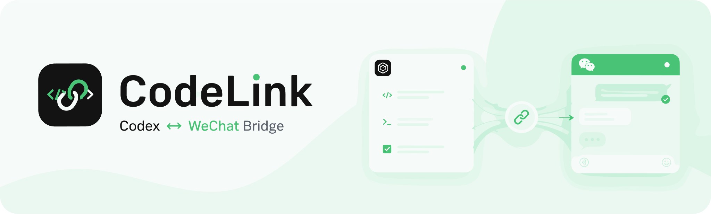

# CodeLink

在微信里继续 Codex，也让任意 Codex 任务主动找你。CodeLink 不安装、不运行、也不依赖 OpenClaw。

## 最快使用

1. 在微信进入 **设置 → 插件**，找到 **微信 ClawBot** 并启用。
2. 不要先下载仓库。新建一个 Codex 任务，把下面这句话发给它：

```text
请按照官方安装契约自行安装或更新 CodeLink，并完成安全自检：https://github.com/zaigie/codelink/blob/main/INSTALL.md。二维码出现后请直接显示在当前主会话并等我扫码。
```

Codex 直接展示二维码后，用已经启用微信 ClawBot 的微信扫码即可连接。剩下的克隆、预构建运行时校验、插件安装和后台服务注册都由 Codex 完成。普通安装只需要 Node.js，不需要 npm；详细提示词也收录在 [INSTALL_PROMPT.md](INSTALL_PROMPT.md)。

## 能做什么

| 你做什么 | CodeLink 做什么 |
| --- | --- |
| 微信发送普通消息 | 继续当前 Codex 会话；没有当前会话时自动新建 |
| 微信发送 `/new` 或说“开个新会话” | 忽略旧上下文，从新会话开始 |
| 桌面任务中说 `@CodeLink 完成后微信通知我` | 通知微信，并把这个任务设为微信当前会话 |
| 收到通知后直接回复 | 继续通知来源的 Codex 会话 |
| 另一个桌面任务再次 `@CodeLink` | 切换到最近通知的任务 |

每个授权微信用户只保存一个当前 thread ID；完整对话历史仍由 Codex 管理。多个任务并行时，较早任务稍后完成也不会抢回已经更新的绑定。

微信新建的不同会话使用各自独立的 thread ID，但统一以 `~/Documents/Codex/CodeLink` 作为 Codex 项目目录，不再为每个会话生成时间戳目录。这样为 Codex 按 cwd 归组时提供稳定的 **CodeLink** 项目归属；远程界面的刷新时机和历史项目呈现仍由 Codex 管理。通过桌面通知绑定的已有会话仍保持它原来的项目目录。

处理微信请求时，CodeLink 使用微信原生的“正在输入”状态表示 Codex 仍在工作，并在长任务中每 5 秒保活；完成、失败或服务停止时自动取消。普通回合只返回 Codex 正文，不显示消息 ID、thread ID 或“当前会话已回复”等内部状态。只有用户明确要求新开会话时，回复才会提示旧上下文不会带入。

## 支持系统

CodeLink 核心不是 macOS 专用：运行时为 Node.js 和纯 JavaScript 依赖，没有原生扩展，也不区分 Intel、Apple Silicon、AMD 或 ARM。当前自动安装覆盖官方 Codex 提供原生二进制的这些组合：

| 系统 | 架构 | 自动常驻方式 |
| --- | --- | --- |
| macOS | x64、arm64 | LaunchAgent |
| Linux | x64、arm64 | systemd user service |
| Windows | x64、arm64 | 当前用户的 Scheduled Task |

macOS 路线已经实机运行；Linux 与 Windows 安装器已完成纯函数、无副作用预检和脚本语法覆盖，仍建议在对应系统完成首轮实机回归后再标记为稳定。

macOS 提醒：CodeLink 当前通过 Node.js 运行 LaunchAgent，因此系统的“后台活动”通知或“登录项与扩展”中可能显示 **Node.js Foundation**，而不是 CodeLink。对应的 LaunchAgent 标识为 `ai.codelink.daemon`；这是 CodeLink 的正常后台进程，不是额外安装的未知服务。

共同要求：Node.js 22+、Git、已经安装并登录的 Codex，以及能够访问 GitHub、腾讯 iLink 的网络。普通安装使用仓库内经过哈希校验的预构建运行时，不要求 npm；只有源码开发和显式 `--build` 才访问 npm。Linux 若不使用 systemd，核心仍可运行，但需要用现有进程管理器或前台启动 daemon；这属于常驻方式差异，不是 CodeLink 核心不支持 Linux。

安装器会把 Codex 原生二进制的绝对路径写入用户态服务，避免 launchd、systemd 或 Windows 计划任务拿不到交互式终端的 PATH。其他 CPU 架构取决于 Node.js 与官方 Codex 是否提供对应二进制，当前不笼统承诺支持。

## 在微信中使用

直接发送文字即可。后续消息默认继续同一会话：

```text
分析这个报错，并给我排查步骤。
再结合刚才的日志缩小范围。
```

需要新上下文时，可以使用命令或自然语言：

```text
/new
/new 帮我规划另一个项目
开个新会话，帮我分析这份方案
换个话题：解释一下这个 API
```

辅助命令：

- `/status`：查看连接和当前会话状态；
- `/help`：查看简要说明。

`/status` 是主动诊断入口，因此会显示当前 thread；日常问答不会主动展示内部 ID。

## 在 Codex 中使用

安装后新建一个 Codex 任务，在输入框键入 `@` 选择 **CodeLink**：

```text
@CodeLink 这个任务完成后微信通知我。
@CodeLink 把当前进度发到微信，我稍后从微信继续。
```

通知会说明当前任务已经成为微信当前会话。模型不需要知道或填写 thread ID；如果 Codex 没有提供可信的调用方 thread 元数据，消息仍可发送，但 CodeLink 不会错误切换已有绑定。

## 能力边界

- 当前只处理文字消息；
- 微信续接不是 HITL 审批，不能在微信批准工具调用或权限请求；
- 微信新建的会话会保存到 Codex，但不保证实时出现在 Codex App 左侧列表；
- 升级不会改写或删除历史 thread；升级前已经生成的时间戳项目仍按 Codex 的历史记录保留；
- CodeLink 使用公开的 [Codex App Server](https://developers.openai.com/codex/app-server/)，不会修改 App 数据库、伪装官方客户端或连接私有 IPC。

完整安装、更新、卸载和故障排查见 [INSTALL.md](INSTALL.md)，更精确的产品边界见 [docs/CAPABILITY_BOUNDARY.md](docs/CAPABILITY_BOUNDARY.md)。

## 开发

终端用户无需执行本节。开发依赖固定使用 `npm@10.9.8`：

```bash
cd plugins/codelink
npm ci
npm run typecheck
npm test
npm run build
```

`npm run build` 会同步生成并校验提交给安装器使用的 `dist` 运行时与哈希清单。

架构说明见 [docs/architecture.md](docs/architecture.md)。已有 OpenClaw Bot 的可选迁移方式见 [docs/OPENCLAW_MIGRATION.md](docs/OPENCLAW_MIGRATION.md)；普通安装不需要阅读或执行迁移步骤。
